> [!WARNING]
> **The code in this repository is deprecated.** The current, actively developed version of this app lives in a private repository, and this README describes that version.

# WAREHOUSE

A Flutter app that lets engineers and technicians borrow tools from a company warehouse and return them. It tracks calibrated equipment and shows what's checked out and what's overdue. Scanning a QR code opens the item's details.


Built for a real warehouse workflow: the idea came from an engineer at a company that runs one, and it targets the problem of tracking who has which tool. <!-- TODO: confirm wording; company name intentionally not mentioned -->

> File names in backticks below refer to the private codebase.

## App screens

**Onboarding and auth** are captured from the running app (Android emulator).

| | | |
|---|---|---|
| 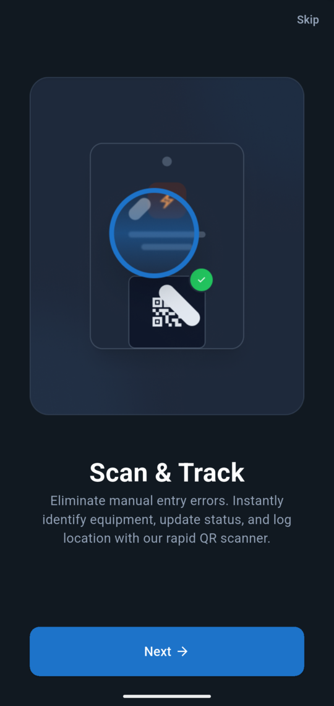 | 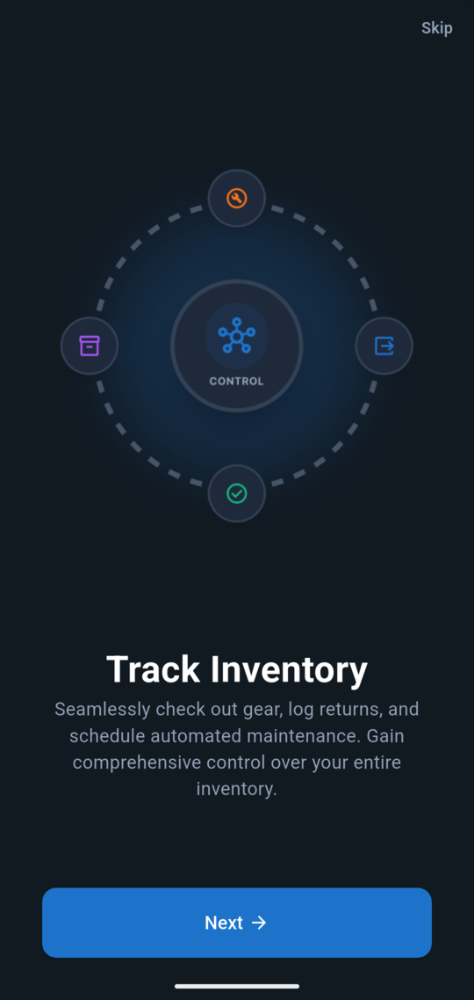 | 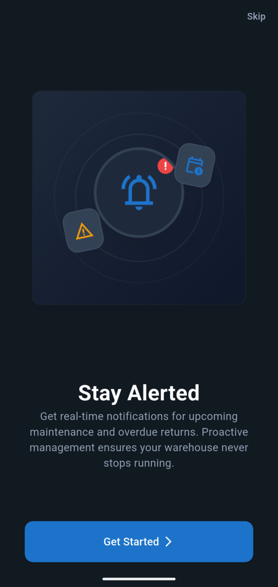 |
| 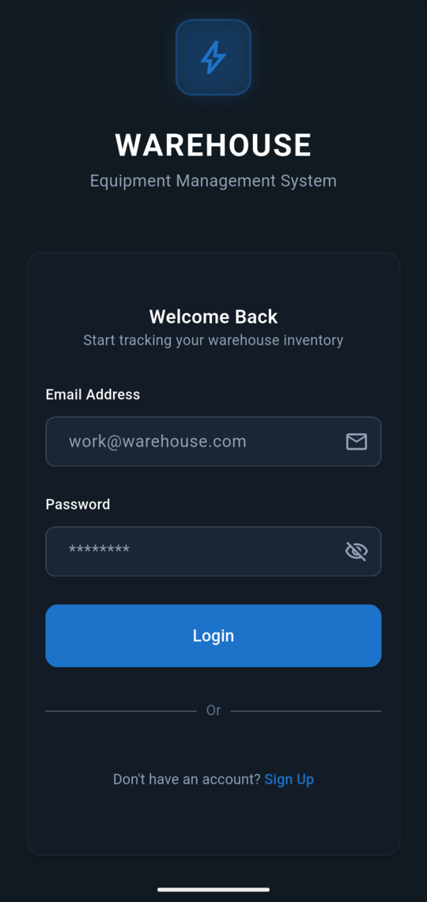 | 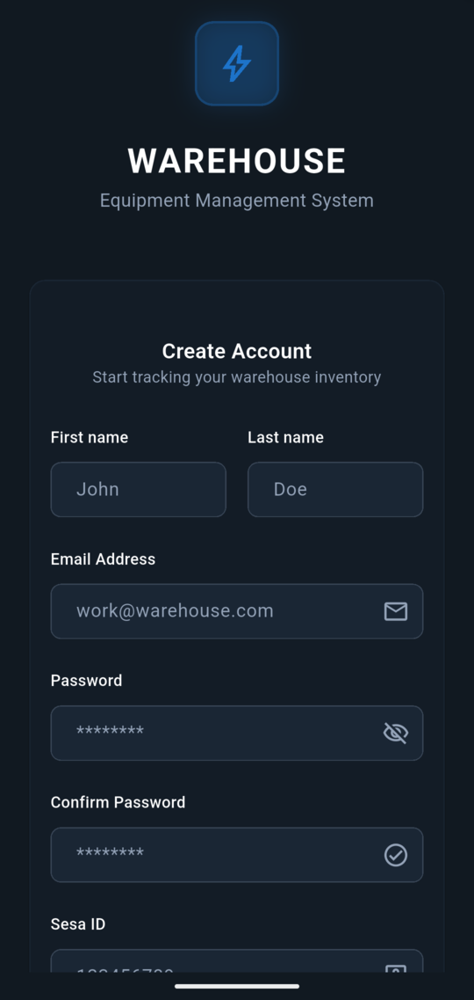 | |

**Home and Equipment Details**

| | |
|---|---|
| 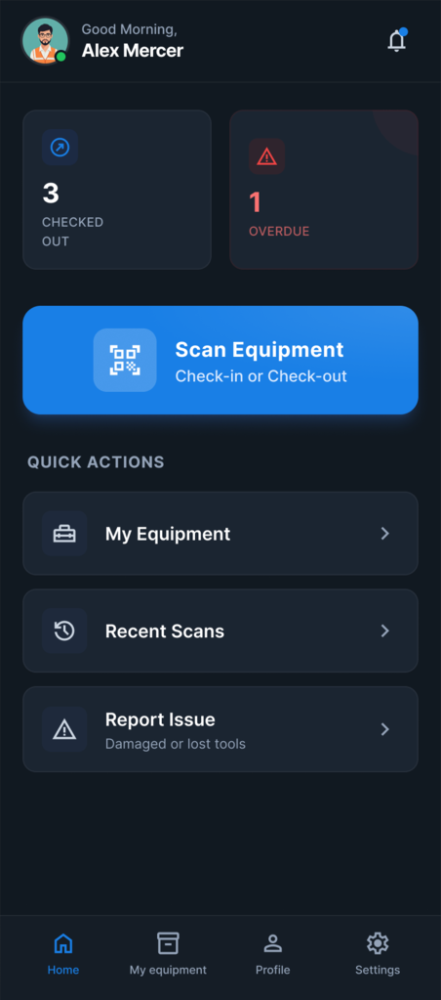 | 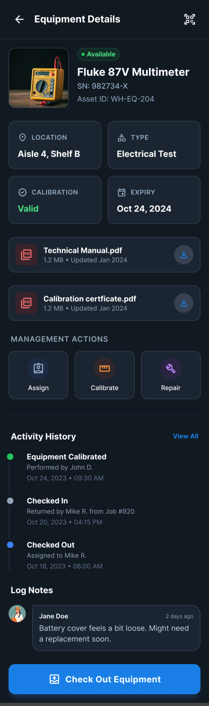 |


<!-- TODO: add a real device GIF/video of scan → details -->

## Features

**Working now**

- Register and log in with email and password; the session is restored on app start
- Home dashboard: checked-out and overdue counts, pull-to-refresh
- QR scanning with camera-permission handling, then a lookup by equipment ID
- Equipment details: status, serial number, branch, category, calibration validity and expiry
- Typed error handling from the API to a user-facing message (no internet, timeout, wrong credentials, account exists, and so on)

- Check-out / check-in operations (the data layer is stubbed)
- Recent operations list

- Inventory, Profile and Settings tabs (currently placeholders in the bottom nav)
- Role-based behavior (the app stores an `employee` or `maintainer` role at sign-up but doesn't act on it yet; the admin role is used from the Appwrite dashboard only)
- CI (`flutter analyze` + `flutter test` on every push)

**Designed, not built yet** (Figma designs)

| | | |
|---|---|---|
| 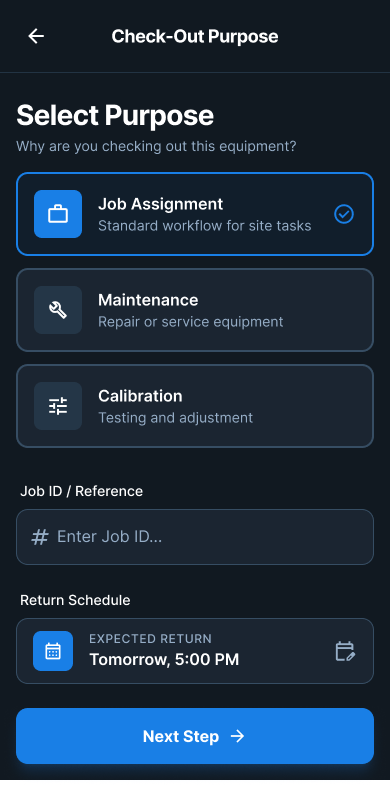 | 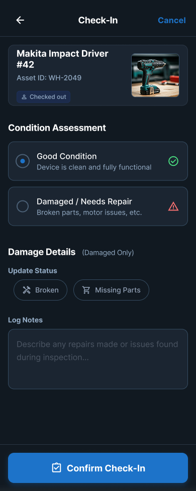 | 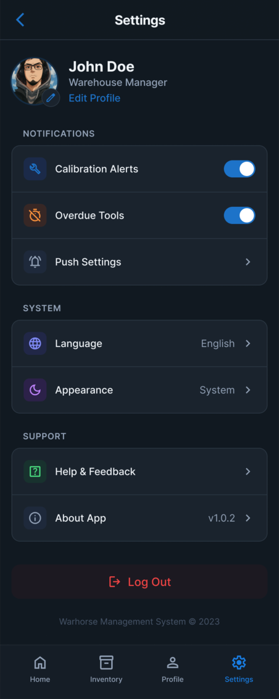 |
| 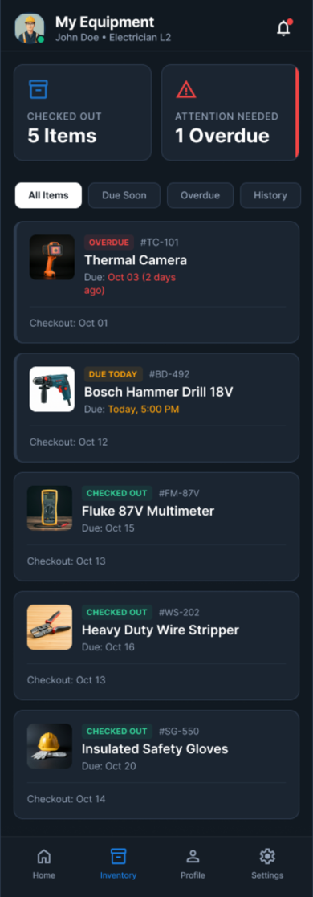 | 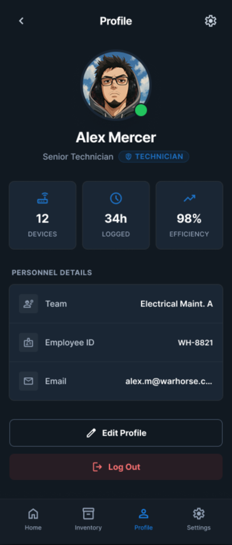 | |

## Tech stack

| | Choice | Why |
|---|---|---|
| Framework | Flutter (Dart 3.10, pinned via FVM `stable`) | One codebase for Android and iOS |
| State | `flutter_bloc` Cubits + `freezed` states | Predictable, testable state with immutable models |
| DI | `get_it` + `injectable` | Generated, environment-aware wiring; repositories and data sources are swappable |
| Backend | Appwrite (client SDK + a Dart Cloud Function) | Auth, relational tables and server-side functions in one service, so there is no custom API server to run; the function is written in Dart, the same language as the app |
| Models | `freezed` + `json_serializable` | DTOs are mapped to separate domain models |
| UI | `flutter_screenutil`, `cached_network_image`, `flutter_svg` | Scaled layout from a 360×690 design size; cached images with fallbacks |
| Device | `qr_code_scanner_plus`, `permission_handler` | QR scanning and the camera permission flow |

## Architecture

Feature-first clean architecture: each feature has `data`, `domain` and `presentation` layers. UI talks to Cubits, Cubits talk to repository interfaces, and repositories wrap remote data sources.

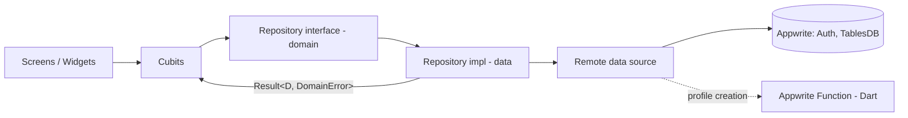

```
lib/
├── core/        # DI, router, theme, Appwrite client, Result and error types
├── features/
│   ├── auth/        # data / domain / presentation (AuthCubit)
│   ├── equipment/   # data / domain / presentation (EquipmentCubit)
│   ├── layout/      # bottom navigation (LayoutCubit)
│   ├── onboarding/
│   └── splash/
├── home/        # home screen, QR scan widgets
└── shared/session/  # SessionCubit: onboarding → auth → app routing
appwrite/        # Dart Cloud Function (creates the user profile)
```

## Engineering highlights

- **Typed error pipeline.** Repositories return a sealed `Result<D, E>`; Appwrite status codes and network exceptions map to `AppwriteError` / `NetworkError` enums, and the Cubit turns them into messages. Failures never throw into the UI. (`result.dart`, `auth_cubit.dart`)
- **Session-driven navigation.** A single `SessionCubit` decides between onboarding, auth and the app. One `BlocListener` at the root performs the route replacement, so screens don't navigate themselves. (`session_cubit.dart`, `main.dart`)
- **Server-side profile creation.** Registration creates the auth account, then calls an Appwrite Function that writes the profile row with per-user read/update/delete permissions. If the profile write fails, the function deletes the auth user so no half-created accounts remain. (`user_handler.dart`)
- **Relational queries.** The dashboard loads checked-out and overdue lists in parallel (`Future.wait`) from the operations table, using `Query.select` with nested relations (equipment, model, branch, employee). (`equipment_appwrite.dart`)

## Testing

86 tests, all running without a backend or a device:

- **Logic:** the `Result` type, Appwrite and network error mapping, and the Auth, Session, Equipment, Onboarding and Layout Cubits.
- **Data layer:** repositories (error mapping, DTO → domain) and the Appwrite data sources, run against fake `Account` / `TablesDB` objects. They check the queries sent and the register → profile-function → login sequence.
- **UI:** widget tests for onboarding, login/sign-up validation, home, equipment details, the bottom navigation and the router fallback.

Fakes are hand-written, so no mocking packages are needed.

```bash
flutter test
```

Not covered: the camera QR scanner (needs a device), network image loading, the generated DI config, and integration tests against a real Appwrite project.
